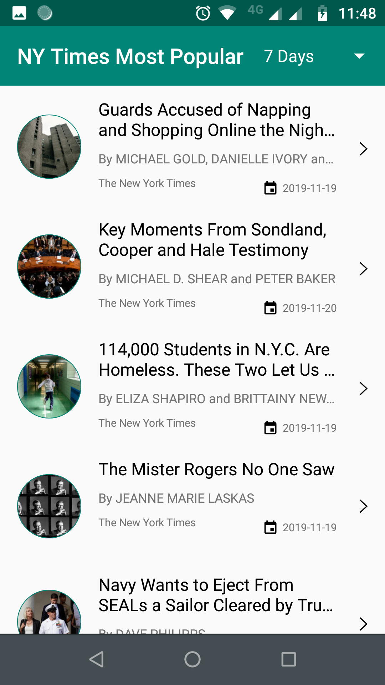

# MostPopularArticles using NY Times API

NY-Times-Most-Popular-Articles-Android with MVVM architecture. In this project we fetch the most popular articles from NY Times API.

This project developed using RXJava, Dagger2, Retrofit etc.

## Screenshots:

**Please check below app screenshot.**

